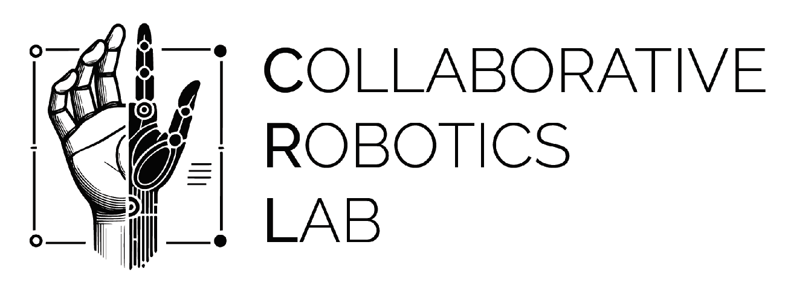

  <h1>Collaborative Robotics Lab (CRL)</h1>

   
  
Welcome to the official GitHub organization for the University of Canberra's Collaborative Robotics Lab!

  <a href="https://www.canberra.edu.au/uc-research/faculty-research-centres/hct/areas-of-research/robotics">Website</a>
  &nbsp;&nbsp;•&nbsp;&nbsp;
  <a href="https://www.linkedin.com/company/collaborative-robotics-lab/">Linkedin</a>
  
   
  

## Welcome to the team 🙌

### 🙋‍♀️ About Us

The Collaborative Robotics Lab (CRL) is part of the Faculty of Science and Technology at the University of Canberra. We're a strong interdisciplinary Research Team with interests in Human-Robt Interaction, robot manipulation and perception and robotic art.

### 🌈 How to Contribute

We welcome contributions from both internal and external collaborators. If you're a faculty member, student, or researcher at the University of Canberra, we encourage you to get involved in our projects and contribute your ideas and expertise. If you're an external contributor, feel free to explore our projects and submit your contributions through pull requests.

To get started, please review our contribution guidelines to ensure a smooth collaboration process.

### 👋 Contact Us

If you have any questions, or suggestions, or would like to get involved in our projects, please don't hesitate to reach out to us. More information and contact can be found at [our official website](https://www.canberra.edu.au/uc-research/faculty-research-centres/hct/areas-of-research/robotics).

We look forward to collaborating with you and advancing the fields of science and technology together!
